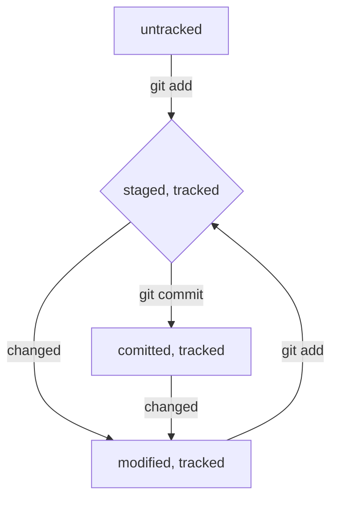
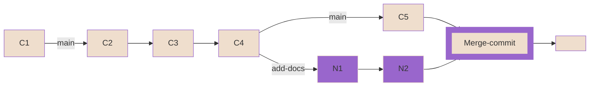

# Команды Git
##### 1. Без указания ‘git’ вначале
 - **pwd** в какой папке сейчас
 - **cd [адрес папки ]** перейти в другую папку
 - **ls** показать содержание папки, по умолчанию текущей (**[-a]** выводит и скрытые файлы, **[адрес]**)
 - **touch [название файла]** создает файл
 - **mkdir [название папки]** создает папку
 - **cp [*что копируем 1 что копируем 2] [куда копируем]** копирует файл
 - **mv [*что перемещаем] [куда перемещаем]** перемещает файл
 - **cat [текстовый файл]** выводит файл в консоль
 - **rm [файл]** удалить файл
 - **rmdir [папка]** удалить пустую папку (**[-r]** удаляет папку с содержимым, рекурсивно)
 - **echo "<текст>"** вывод текста на экран
 - **echo "<текст>" >> <file>** добавление текста в файл 
 - **echo "<текст>" > <file>** перезапись файла с новым тексом
##### 2. Начинающиеся с git вначале
  ###### 1) Инициализация локального репозитория
  - **git init** сделать текущую папку репозиторием
  - **rm -rf .git** снять репозиторий с папки (разгитить) (recursive — «рекурсивно», force — «заставить»)
  - **git status** проверить состояние репозиторий
  - **git status --ignored** отобразить и игнорируемые файлы
  ###### 2) Индексация и коммиты
  - **git add** добавить файлы (**[имя файла или через пробел файлов] / [--all]** для добавления всех фалов из текущей папки)
  - **git commit [-m] ‘Комментарий’** создать коммит с комментарием
  - **git log** просмотреть историю коммитов (**_[--oneline]_** сокращенный лог, для выхода из истории **Q**)
  ###### 3) Работа с удаленным репозиторием
  - **git remote add origin [ссылка SSH ключ удаленного репозитория]** привязать локальный репозиторий к удаленному; если здесь имя не origin (e.g. original как у меня), то и далее используем это имя
  - **git remote –v** убедиться, что репозитории связаны
  - **git remote rm origin** удалит текущий origin
  - **git push -u origin master (или main)** отправить изменения на удаленный репозиторий в первый раз 
  - **git push** отправить изменения на удаленный репозиторий
  - **git push -u origin main** связать локальную ветку main с удаленной, нужно находится в ней
  - **git push -u origin [branche name]** отправь новую ветку my-branch в удалённый репозиторий и свяжи локальную ветку с удалённой, чтобы при дополнительных коммитах можно было писать просто git push без -u (не обязательно находится в ней)
  - **git push [branche name]** отправь дополнительные изменения в ветку, которая уже существует в удалённом репозитории;
  - **git pull** подтянуть изменения из удалённого репозитория. Сначала нужно перейти в локальный репозиторий и убедиться, что вы находитесь в правильной ветке, — как правило, это основная ветка main (или master). Затем можно ввести команду.
> Перед созданием пул-реквеста рекомендуется сначала подтянуть изменения из основной ветки, объединить их с вашей, решить все возможные конфликты и лишь затем сделать push:

> $ git checkout main # перешли в main
> 
> $ git pull # подтянули новые изменения в main
>
> $ git checkout my-branch # вернулись в рабочую ветку my-branch
>
> $ git merge main # влили main в новую ветку my-branch
>
> $ git push -u origin my-branch # отправили ветку my-branch в удалённый репозиторий
  ###### 4) Изменить коммит
  - **git commit --amend --no-edit** дополнить коммит новыми файлами; только в отношении последнего коммита (HEAD), благодаря опции --no-edit сообщение к коммиту останется таким, каким и было.
  - **git commit --amend -m "Обновлённое сообщение коммита"** изменить сообщение к коммиту, только в отношении последнего коммита (HEAD)
  ###### 5) Откатить назад изменения
  - **git restore --staged <file>** переведёт файл из staged обратно в modified или untracked.
  - **git reset --hard <commit hash>** «откатит» историю до коммита с хешем <hash>. Более поздние коммиты потеряются!
  - **git restore <file>** «откатит» изменения в файле до последней сохранённой (в коммите или в staging) версии.
  ###### 6) Сравнить изменения
  - **git diff** сравнить последнюю закоммиченную версию файла с той, что находится в состоянии modified
  - **git diff --staged** покажет изменения в staged-файлах относительно последних закоммиченных версий
  - **git diff <хеш коммита> <хеш коммита/HEAD для последнего коммита> сранение изменений 
  ###### 7) Копирование репозиториев
  - **git clone <Code-SSH>** копирует удаленный репозиторий в папку, из которой вызвана эта команда; автоматически связывает локальный репозиторий с удалённым
  ###### 8) Ветки
  - **git branch** выводятся ветки, которые есть в проекте; звёздочкой (*) отмечено, в какой ветке вы находитесь в текущий момент
  - **git branch <название_ветки>** создать ветку
  - **git checkout <название_ветки>** переключиться на ветку
  - **git checkout -b <название_ветки>** создать ветку и сразу переключиться на нее
  - **git branch -a** покажи все известные ветки, как локальные (в локальном репозитории), так и удалённые (в origin, или на GitHub).
  - **git diff <название_ветки1> <название_ветки2>** сравнить ветки (можно указывать название ветки, ее хэш, указатель HEAD, а таже использовать к ним суфиксную навигацию, например: HEAD~ или что тоже самое HEAD~1 для предыдущего комита от HEAD. Цифра после тильды показывает "уровень наследования": 0 для самого комита, 1 для предыдущего, 2 для предыдущего предыдущего и т.д.) 

>Например, если вы находитесь в ветке main и хотите вывести разницу между тем коммитом, который был три коммита назад, и текущим, 
> нужно выполнить git diff main~3 main.

  - **git merge <название_ветки>** выполнить слияние (обычно из main/master)
  - **git branch -D <название_ветки>** удалить ветку после объединения
  - **git branch -d <название_ветки>** удалит ветку только если она была полностью объединена с другой — то есть если две ветки стали (или изначально были) частью одной истории

> Удаление локальной ветки через Git не удаляет ветку на GitHub!

  ###### 9) Pull request
  - У каждого пул-реквеста есть:
Название — краткое описание предлагаемых изменений. Например: Адаптивный заголовок сайта, Замена альбома на галерею и так далее.
Описание — развёрнутое описание изменений. Это поле заполнять необязательно, но желательно.
Исходная ветка — та, в которой вы работали. Например, feature/merge-request.
Целевая ветка — основная ветка проекта, в которую вы хотите внести изменения.
  - У каждого пул-реквеста может быть два исхода:
merge (англ. «соединить») — предлагаемые изменения приняты; код вливается в целевую ветку; пул-реквест закрывается.
close (англ. «закрыть») — пул-реквест закрывается без слияния изменений. 
  - После того как новая ветка «запушена» в удалённый репозиторий, можно делать пул-реквест. Существует два способа.
+ а) Первый способ. При создании новой ветки в удалённом репозитории Git распечатает сообщение. Оно включает ссылку на создание пул-реквеста. Однако такая ссылка появляется только один раз и для новых веток, поэтому иногда приходится идти более сложным путём.
+ б) Второй способ. Чтобы создать пул-реквест для любой существующей ветки на GitHub, перейдите на страницу репозитория, а затем выберите вкладку Pull requests в верхней части экрана. Нажмите на зелёную кнопку New pull request. Выберите названия веток: ветка «откуда» (из которой будет происходить пул-реквест) и ветка «куда» (в которую он будет осуществлён). В окне ниже отобразится несколько коммитов, а также их изменения. Нажмите на кнопку Create pull request. Заполните поля с названием и описанием пул-реквеста. Нажмите Create pull request. 


##### 3. GitHub-операции
  - **Fork** -> **Create fork** создаёт независимую копию репозитория в аккаунте GitHub

##### 4. Аргументы общие
  - **[~]** домашняя директория
  - **[..]** выше по каталогу
  - **[.]** текущая директория
 
##### 5. Иное
   - **&&** объединение команд в строке
   - **↑↓** листает историю команд
   - **TabTab** подсказка
   - **Tab** автозаполнение
   - **Q** выход из режима просмотра истории коммитов

##### 6. Создать репозиторий удаленный(GitHub) - > git add -> git commit

##### 7. Язык для форматирования README.mb: Markdown

  - [шпаргалка на GitHub по Markdown](https://gist.github.com/fomvasss/8dd8cd7f88c67a4e3727f9d39224a84c#links "на русском")
  - [демо-версия](https://markdown-here.com/livedemo.html)
  - [Markdown Cheat Sheet](https://www.markdownguide.org/cheat-sheet/ "in English")
  - [создание блок-схем](https://github.blog/2022-02-14-include-diagrams-markdown-files-mermaid/)
  - [визуализатор для создания диаграм на mermaid](https://mermaid.live/)

##### 8. HEAD - указывает на последний коммит, один из служебных файлов папки .git
  - Внутри него ссылка на служебный файл: refs/heads/master (или refs/heads/main в зависимости от названия ветки). Если заглянуть в этот файл, можно увидеть хеш последнего коммита.
  - Если нужно передать последний коммит, то вместо его хеша можно просто написать слово HEAD — Git поймёт, что вы имели в виду последний коммит.

##### 9. Статусы файлов в Git
  - **untracked** неотслеживаемый, до первого add
  - **staged** подготовленный, после add неизмененный; Staging area также называют index (англ. «каталог») или cache (англ. «кеш»), а состояние файла staged иногда называют **indexed** или **cached**.
  - **tracked** отслеживаемый, т.е. любой после первого add
  - **modified** измененный, требует add до его коммита



##### 10. Стиль коммитов
  - короткие и инфермативные, могут быть корпаративные требования и коды для других программ
  - на русском в инфенитиве, e.g. "Создать файл Gap.txt"
  - английском в повелительном, e.g. "Fix exit buttom"

##### 11. Выйти из редактора
  Если забыть указать у команды git commit --amend один из флагов (--no-edit или -m), Git предложит отредактировать сообщение коммита вручную. Для этого он откроет текстовый редактор, который установлен в системе по умолчанию. Чаще всего это либо GNU nano, либо Vim.
  - nano — простой и свободный
  - nano: изменить коммит -> Ctrl+X -> Y -> Enter
  - nano: не менять коммито -> Ctrl+X -> N
  - Vim — великий и ужасный
  - Vim: нажать Esc, ввести :qa!, нажать Enter.
  - Если ваша текущая или будущая профессия связана с работой в консоли Linux, рекомендуем заглянуть в учебник по работе с Vim.
Для запуска учебника на русском языке достаточно выполнить команду vimtutor ru. Без ru запустится английская версия.

##### 12. Игнорирование файлов (.gitignore)
  С точки зрения Git .gitignore — это обычный текстовый файл. Его добавляют в корень репозитория и тоже коммитят.
В простейшем случае в .gitignore указывают все файлы, которые нужно игнорировать (по одному имени на строку). Но часто удобнее использовать шаблоны.

Правила из .gitignore применяются только к новым (untracked) файлам. Если файл уже попал в staging area или в коммит, то правила на него не распространяются.

  - **#** комментарий, git не учитывает
  - **.<имя файла>** игноривать файлы с этим именем во всех папаках
  - __*__ соответствует любой строке, включая пустую. Если такой символ используется в шаблоне в .gitignore, значит, файл будет проигнорирован вне зависимости от того, что будет на месте звёздочки.

> _*.jpeg_ игнорировать все файлы, которые заканчиваются на .jpeg
> _docs/*/tmp_ игнорировать все файлы "tmp" во всех подпапках папки docs
  - Вопросительный знак ? соответствует одному любому символу.
> Если сохранить такую запись в .gitignore, то будут проигнорированы, например, файлы fileA.txt и file1.txt. А вот файл file12.txt не будет проигнорирован, потому что в его названии два символа после file, а не один.
  - Квадратные скобки, как и вопросительный знак, соответствуют одному символу. При этом символ не любой, а только из списка, который указан в скобках
> В скобках можно либо перечислить символы ([abc]), либо задать диапазон ([a-z]). Например: file[0-2].txt.
  - Косая черта, или слеш (/), указывает на каталоги. Если шаблон в .gitignore начинается со слеша, то Git проигнорирует файлы или каталоги только в корневой директории.
  - Если шаблон заканчивается слешем, то правило применится только к папке.
  - Обратите внимание: если build — это папка, то она будет проигнорирована. Если build — обычный файл, то он не подпадёт под правило и не будет игнорироваться.
  - Функция парных звёздочек (**) похожа на функцию одинарной (*). Отличие в том, как они работают с вложенными папками. Двойная звёздочка может соответствовать любому количеству таких папок (в том числе нулю). Одинарная может соответствовать только одной.
  - Любое правило в файле .gitignore можно инвертировать с помощью восклицательного знака (!).\

##### 13. fast-forward
  - **git merge --no-ff <название вветки>** Fast-forward слияние веток можно отключить флагом --no-ff
  - **merge.ff: git config [--global] merge.ff false**   отключить «навсегда» (до тех пор, пока вы не вернёте настройку «как было»)
  
- истории двух веток можно выстроить в одну линию, и их коммиты никкак не пересекутся;
- конфликт слияния невозможен;
- при слиянии веток по умолчанию не будет merge-commit.

>Если отключить слияние в режиме fast-forward, вместо «перемотки» ветки Git создаст в ней коммит слияния (англ. merge commit) — в обиходе его называют merge-коммит или мёрж-коммит. 

Две ветки находятся в состоянии fast-forward, если одну из них можно «перемотать» вперёд и она будет содержать те же коммиты, что и другая. Это утверждение можно сформулировать иначе:
  - при слиянии этих двух веток никак не возможен конфликт;
  - истории этих двух веток не «разошлись»;
  - одна ветка является продолжением другой.   

Разберём на примере:

Есть две ветки: main и add-docs. В ветке main четыре коммита (C1, C2, C3, C4), от неё создали ветку add-docs и добавили в неё ещё два коммита.
Ветка add-docs «обгоняет» ветку main на два коммита: N1 и N2. Допустим, мы хотим влить ветку 
add-docs в main. При этом все коммиты из add-docs можно просто «положить» в main, 
и они выстроятся за уже существующими.
  
$ git checkout main

$ git merge add-docs

Git просто добавил коммиты из add-docs в ветку main, или перемотал main вперёд до состояния add-docs. Отсюда и название «перемотка».
При слиянии веток Git выводит строку Fast-forward.
В истории коммитов HEAD указывает одновременно и на main, и на add-docs. После такого слияния эти ветки одинаковые: в них одни и те же коммиты.

##### 13. non-fast-forward

- **git merge --no-edit <branch name>** non-fast-forward слияние веток, находимся в main, --no-edit избавляет от необходимости вводить сообщение для merge-commit; 
- истории двух веток нельзя выстроить в одну цепочку;
- конфликт слияния возможен;
- при слиянии веток обязательно будет merge-commit.

Вернёмся к примеру с ветками main и add-docs и представим такую ситуацию: истории двух веток «разошлись». Это значит, что их коммиты уже нельзя выстроить в одну линию.
Например, после «отделения» add-docs в ветку main добавили новый коммит Commit 5.

```mermaid
flowchart LR
  A[C1] -- "main" --> B[C2]
  B --> C[C3]
  C --> D[C4]
  D -- "main" --> E[C5]
  D -- "add-docs" --> F[N1]
  F --> J[N2]
  style A fill:#efdecd, stroke: #96c
  style B fill:#efdecd, stroke: #96c
  style C fill:#efdecd, stroke: #96c
  style D fill:#efdecd, stroke: #96c
  style E fill:#efdecd, stroke: #96c
  style F fill:#96c, stroke:#efdecd
  style J fill:#96c, stroke:#efdecd
  ```

Теперь просто «положить» все коммиты из add-docs в main не получится. Например, коммит C5 из main может конфликтовать с каким-нибудь коммитом из ветки add-docs (N1 или N2). То есть содержать изменения в тех же файлах (и в тех же строках), что и коммит C5.

Когда Git проверяет ветки на состояние fast-forward, он не «заглядывает» в файлы и не пытается угадать, будет ли конфликт на самом деле. Для Git важно только, что конфликт теоретически возможен (или, наоборот, никак не возможен).

``` git
# находимся в ветке main
# --no-edit избавляет от необходимости
# вводить сообщение для merge-коммита
$ git merge --no-edit add-docs
Merge made by the 'ort' strategy.
 docs.txt | 1 +
 1 file changed, 1 insertion(+)
 create mode 100644 docs.txt

# коммит слияния: 34f5f8f
$ git log --graph --oneline
*   34f5f8f (HEAD -> main) Merge branch 'add-docs'
|\
| * 8de42eb (add-docs) New docs 2
| * 4d3c346 New docs 1
* | 15d3f04 Commit 5
|/
* 73def1e Commit 4
* 9c30ab3 Commit 3
* 83cc5ec Commit 2
* 8e87fb2 Commit 1
```
На схеме это будет выглядеть так.


Если конфликтов при слиянии нет, команда git merge отработает почти автоматически — только предложит вам ввести сообщение для нового коммита слияния.  

💡 Чаще всего сообщения к коммитам слияния не редактируют и оставляют «как предложил Git». Для таких случаев удобен флаг --no-edit: git merge --no-edit %another_branch%.  
Если конфликты всё-таки есть, Git сначала попытается разрешить их автоматически. Если не получится, Git предложит вам разрешить их вручную. Как разрешать конфликты и какие для этого есть инструменты, мы покажем в следующих уроках модуля.  

