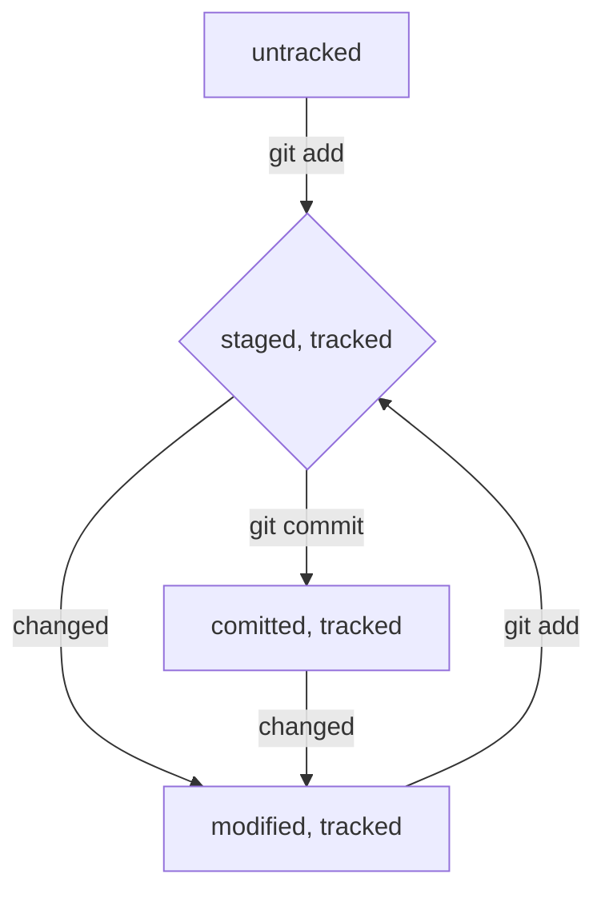

# Команды Git
##### 1. Без указания ‘git’ вначале
 - **pwd** в какой папке сейчас
 - **cd [адрес папки ]** перейти в другую папку
 - **ls** показать содержание папки, по умолчанию текущей (**[-a]** выводит и скрытые файлы, **[адрес]**)
 - **touch [название файла]** создает файл
 - **mkdir [название папки]** создает папку
 - **cp [*что копируем 1 что копируем 2] [куда копируем]** копирует файл
 - **mv [*что перемещаем] [куда перемещаем]** перемещает файл
 - **cat [текстовый файл]** выводит файл в консоль
 - **rm [файл]** удалить файл
 - **rmdir [папка]** удалить пустую папку (**[-r]** удаляет папку с содержимым, рекурсивно)
 - **echo "<текст>"** вывод текста на экран
 - **echo "<текст>" >> <file>** добавление текста в файл 
 - **echo "<текст>" > <file>** перезапись файла с новым тексом
##### 2. Начинающиеся с git вначале
  ###### 1) Инициализация локального репозитория
  - **git init** сделать текущую папку репозиторием
  - **rm -rf .git** снять репозиторий с папки (разгитить) (recursive — «рекурсивно», force — «заставить»)
  - **git status** проверить состояние репозиторий
  - **git status --ignored** отобразить и игнорируемые файлы
  ###### 2) Индексация и коммиты
  - **git add** добавить файлы (**[имя файла или через пробел файлов] / [--all]** для добавления всех фалов из текущей папки)
  - **git commit [-m] ‘Комментарий’** создать коммит с комментарием
  - **git log** просмотреть историю коммитов (**_[--oneline]_** сокращенный лог, для выхода из истории **Q**)
  ###### 3) Связь локального и удаленного репозитория
  - **git remote add origin [ссылка SSH ключ удаленного репозитория]** привязать локальный репозиторий к удаленному; если здесь имя не origin (e.g. original как у меня), то и далее используем это имя
  - **git remote –v** убедиться, что репозитории связаны
  - **git push -u origin master (или main)** отправить изменения на удаленный репозиторий в первый раз 
  - **git push** отправить изменения на удаленный репозиторий
  ###### 4) Изменить коммит
  - **git commit --amend --no-edit** дополнить коммит новыми файлами; только в отношении последнего коммита (HEAD), благодаря опции --no-edit сообщение к коммиту останется таким, каким и было.
  - **git commit --amend -m "Обновлённое сообщение коммита"** изменить сообщение к коммиту, только в отношении последнего коммита (HEAD)
  ###### 5) Откатить назад изменения
  - **git restore --staged <file>** переведёт файл из staged обратно в modified или untracked.
  - **git reset --hard <commit hash>** «откатит» историю до коммита с хешем <hash>. Более поздние коммиты потеряются!
  - **git restore <file>** «откатит» изменения в файле до последней сохранённой (в коммите или в staging) версии.
  ###### 6) Сравнить изменения
  - **git diff** сравнит последнюю закоммиченную версию файла с той, что находится в состоянии modified
  - **git diff --staged** покажет изменения в staged-файлах относительно последних закоммиченных версий
  - **git diff <хеш коммита> <хеш коммита/HEAD для последнего коммита> сранение изменений 

##### 3. Аргументы общие
  - **[~]** домашняя директория
  - **[..]** выше по каталогу
  - **[.]** текущая директория
 
##### 4. Иное
   - **&&** объединение команд в строке
   - **↑↓** листает историю команд
   - **TabTab** подсказка
   - **Tab** автозаполнение
   - **Q** выход из режима просмотра истории коммитов

##### 5. Создать репозиторий удаленный(GitHub) - > git add -> git commit

##### 6. Язык для форматирования README.mb: Markdown

  - [шпаргалка на GitHub по Markdown](https://gist.github.com/fomvasss/8dd8cd7f88c67a4e3727f9d39224a84c#links "на русском")
  - [демо-версия](https://markdown-here.com/livedemo.html)
  - [Markdown Cheat Sheet](https://www.markdownguide.org/cheat-sheet/ "in English")
  - [создание блок-схем](https://github.blog/2022-02-14-include-diagrams-markdown-files-mermaid/)

##### 7. HEAD - указывает на последний коммит, один из служебных файлов папки .git
  - Внутри него ссылка на служебный файл: refs/heads/master (или refs/heads/main в зависимости от названия ветки). Если заглянуть в этот файл, можно увидеть хеш последнего коммита.
  - Если нужно передать последний коммит, то вместо его хеша можно просто написать слово HEAD — Git поймёт, что вы имели в виду последний коммит.

##### 8. Статусы файлов в Git
  - **untracked** неотслеживаемый, до первого add
  - **staged** подготовленный, после add неизмененный; Staging area также называют index (англ. «каталог») или cache (англ. «кеш»), а состояние файла staged иногда называют **indexed** или **cached**.
  - **tracked** отслеживаемый, т.е. любой после первого add
  - **modified** измененный, требует add до его коммита

##### 9. Стиль коммитов
  - короткие и инфермативные, могут быть корпаративные требования и коды для других программ
  - на русском в инфенитиве, e.g. "Создать файл Gap.txt"
  - английском в повелительном, e.g. "Fix exit buttom"

##### 10. Выйти из редактора
  Если забыть указать у команды git commit --amend один из флагов (--no-edit или -m), Git предложит отредактировать сообщение коммита вручную. Для этого он откроет текстовый редактор, который установлен в системе по умолчанию. Чаще всего это либо GNU nano, либо Vim.
  - nano — простой и свободный
  - nano: изменить коммит -> Ctrl+X -> Y -> Enter
  - nano: не менять коммито -> Ctrl+X -> N
  - Vim — великий и ужасный
  - Vim: нажать Esc, ввести :qa!, нажать Enter.
  - Если ваша текущая или будущая профессия связана с работой в консоли Linux, рекомендуем заглянуть в учебник по работе с Vim.
Для запуска учебника на русском языке достаточно выполнить команду vimtutor ru. Без ru запустится английская версия.

##### 11. Игнорирование файлов (.gitignore)
  С точки зрения Git .gitignore — это обычный текстовый файл. Его добавляют в корень репозитория и тоже коммитят.
В простейшем случае в .gitignore указывают все файлы, которые нужно игнорировать (по одному имени на строку). Но часто удобнее использовать шаблоны.

Правила из .gitignore применяются только к новым (untracked) файлам. Если файл уже попал в staging area или в коммит, то правила на него не распространяются.

  - **#** комментарий, git не учитывает
  - **.<имя файла>** игноривать файлы с этим именем во всех папаках
  - __*__ соответствует любой строке, включая пустую. Если такой символ используется в шаблоне в .gitignore, значит, файл будет проигнорирован вне зависимости от того, что будет на месте звёздочки.

> _*.jpeg_ игнорировать все файлы, которые заканчиваются на .jpeg
> _docs/*/tmp_ игнорировать все файлы "tmp" во всех подпапках папки docs
  - Вопросительный знак ? соответствует одному любому символу.
> Если сохранить такую запись в .gitignore, то будут проигнорированы, например, файлы fileA.txt и file1.txt. А вот файл file12.txt не будет проигнорирован, потому что в его названии два символа после file, а не один.
  - Квадратные скобки, как и вопросительный знак, соответствуют одному символу. При этом символ не любой, а только из списка, который указан в скобках
> В скобках можно либо перечислить символы ([abc]), либо задать диапазон ([a-z]). Например: file[0-2].txt.
  - Косая черта, или слеш (/), указывает на каталоги. Если шаблон в .gitignore начинается со слеша, то Git проигнорирует файлы или каталоги только в корневой директории.
  - Если шаблон заканчивается слешем, то правило применится только к папке.
  - Обратите внимание: если build — это папка, то она будет проигнорирована. Если build — обычный файл, то он не подпадёт под правило и не будет игнорироваться.
  - Функция парных звёздочек (**) похожа на функцию одинарной (*). Отличие в том, как они работают с вложенными папками. Двойная звёздочка может соответствовать любому количеству таких папок (в том числе нулю). Одинарная может соответствовать только одной.
  - Любое правило в файле .gitignore можно инвертировать с помощью восклицательного знака (!).